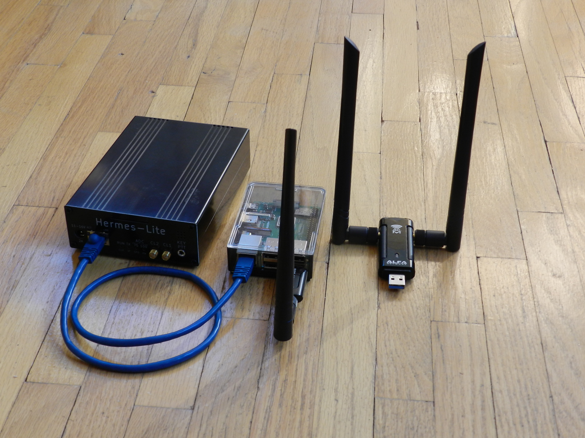

# A WiFi Adapter for the Hermes Lite 2
## by James Ahlstrom, N2ADR
**February 22, 2024**

## The Hermes Lite 2
The [Hermes Lite2](http://www.hermeslite.com) is a low-cost direct sampling software defined amateur radio HF transceiver.
It is for sale by  [Makerfabs](https://www.makerfabs.com) and has enjoyed great success. It connects via Ethernet to a PC running radio software.
Many users have tried to use a WiFi connection instead of a cable but have had limited success.
While receive performance can be adequate, transmit performance is troublesome. Users often experience T/R relay chattering.
The problem comes from sending transmit I/Q samples to the HL2 through a WiFi path with large delays.
The small transmit sample buffer in the HL2 is not sufficient to smooth out the sample receipt.
As a result the HL2 is starved for samples and drops the T/R relay until more sample arrive.
Using a bigger Tx sample buffer is a problem due to the limited FPGA resources and
the pressure from the user base to design for a large number of receive slices.

## HL2 WiFi Adapter
This project is a software WiFi adapter specifically designed for the HL2. The adapter software runs on a Linux single board computer.
One side of the adapter connects to the WiFi network and to the PC radio software.
The other side connects by an Ethernet cable to the HL2. Data sent from the HL2 to the PC is copied from Ethernet to WiFi. The transmit samples sent from the
PC to the HL2 are saved in a large buffer and are fed to the HL2 at a constant rate. The large buffer smooths out the jitter in the WiFi network.
The constant rate enables the HL2 to use its transmit buffer as efficiently as possible.

This project is not related to my SDR software Quisk, and it should work with any PC software that
uses the Hermes 1 protocol, such as Quisk, Spark, pihpsdr, etc.

#### The WiFi adapter running on a Raspberry Pi with External Adapters


## Hardware
To use the adapter you need a Linux single board computer (SBC). There are many choices, anything from an old Raspberry Pi 3 to a new
Intel NUC costing several hundred dollars. Some single board computers have WiFi built in. Others will require an adapter.
I have tested with this hardware:

  * Raspberry Pi 3B+ (WiFi is on-board)
  * ROC-RK3328-CC (requires an adapter)
  * ALFA Network AWUS036ACM USB Wireless Adapter (works on Linux)
  * Realtek RTL8812BU USB Wireless Adapter (requires a driver for Linux)

If you have an old SBC in your junkbox, you can start with that. Otherwise don't be fooled into thinking that a faster SBC is better.
The performance of the hardware depends on the IO bandwidth of the Ethernet port and the WiFi port.
A fast CPU doesn't help. Although SBC benchmarks are available, they seldom address IO bandwidth.
Consider the Raspberry Pi 3B+. It has a 1 Gig Ethernet port, but the IO path goes through USB, and is limited to 240 MBits per second.
Be careful with SBC benchmarks. Most of them measure video game, CPU or disk performance, none of which matters here.

WiFi speed is even more troubling. There are the manufacturers' highly optimistic numbers, and there are benchmarks that are more realistic
but can vary widely. And then there is the real world measurement at your location. Remember that WiFi is a radio link. The speed depends on the
signal strength, the quality of the antenna and the amount of interference from other WiFi and Bluetooth devices, cordless phones and microwave heaters.
You can measure your WiFi speed with the "iperf3" program.
The small PCB antennas in the SBC are not very efficient, and it may be better to use an external USB WiFi adapter instead.

Be careful purchasing WiFi adapters. Some work with Linux and some will work if you install a special driver. Search the Internet for recommendations.
Start with [this paper](https://github.com/morrownr/USB-WiFi/blob/main/home/USB_WiFi_Adapters_that_are_supported_with_Linux_in-kernel_drivers.md)
and [this paper](https://github.com/morrownr/USB-WiFi/blob/main/home/USB_WiFi_Adapter_out-of-kernel_drivers_for_Linux.md).

## iperf3
The iperf3 program is the usual utility for measuring WiFi speed. It runs on two computers, the server and the client. In our case,
we want to run one copy of iperf3 on our SBC and another copy on the PC connected by WiFi, and measure the link speed between them.
The iperf3 can send data in either direction, and it can use the TCP or UDP protocol.
This is not an exact match to the HL2 because the HL2 sends data in both directions at once and at different speeds.
And the HL2 meters its UDP traffic to a constant rate, while iperf3 blasts traffic when using UDP.
I found it best to use iperf3 in TCP mode as an approximation of speed.

To use iperf3, first install it on the two computers. It is best that both copies are the same version. Beware of the
very old Windows versions on the web. Then start iperf3 as a server on one computer:

iperf3 -s

Then connect to the server by running iperf3 on the client:

iperf3 -c 192.168.1.79

You need to specify the computer where the server is running with either its name or IP address.
The test data is sent from the client to the server, and measures the upload speed of the client.  Measuring the download speed
from the server can be done by specifying the -R flag on the client.  This causes data to be sent from the server to the client.

iperf3 -c 192.168.1.79 -R

For my tests I ran the server on an Intel NUC7i5BNK running Windows 10 connected to my WiFi access point with Gig Ethernet.
My access point is an Asus RT-AC68U located on the first floor by the TV. The clients are the 3B+ and ROC single board computers listed above.
I did not use the "-R" option, so this is the upload speed of the client.

For the first test, the clients were located on the third floor in my loft:
```
RaspPi 3B+ 2.4 GHz on-board antenna	53 MBits/sec
RaspPi 3B+ 2.4 GHz ALFA antenna		95
RaspPi 3B+ 5 GHz on-board antenna	too weak
RaspPi 3B+ 5 GHz ALFA antenna		153
ROC and ALFA antenna 2.4 GHz		92
ROC and ALFA antenna 5 GHz		176
ROC with Asus RT-AC68U 2.4 GHz		134
ROC with Asus RT-AC68U 5 GHz		56
```
For the next test I moved the clients into the same room as the server:
```
ROC and ALFA antenna 2.4 GHz		90 MBits/sec
ROC and ALFA antenna 5 GHz		178
```
We see that the 5 Ghz band is faster than 2.4 GHz but only if the signal is strong enough. Using an external adapter with a better
antenna provides a stronger signal than a built-in patch antenna. The measured speeds are much lower than I expected.
But the HL2 with one 48 ksps receiver only needs 3.3 Mbits/sec up and 6.6 MBits/sec down, so there is still
plenty of bandwidth available for more receivers and higher sample rates.

## Using the HL2 WiFi Adapter
First configure your single board computer (SBC). Start WiFi and make sure it has an IP address and can connect to your PC software.
Set a fixed IP address of 169.254.1.1/16 on the Ethernet port connected to the HL2.

To install the HL2 adapter software, clone my github site into a suitable directory on your single board computer.
Change to that directory and enter "make". This will make the program hl2_wifi_buffer. To run the program,
enter "./hl2_wifi_buffer".
```
clone git://github.com/jimahlstrom/hl2_wifi_buffer
cd hl2_wifi_buffer
make
./hl2_wifi_buffer
```
Connect your HL2 to the SBC with an Ethernet cable. Do not use a fixed IP address on the HL2. The software
has no DHCP server and it expects the HL2 to use an APIPA address of the form 169.254.x.x.
Then open your web browser and enter the address `http://192.168.1.179:8080` where the IP address is the address
of your SBC and 8080 is the port. You should get a status screen that looks like this:

#### The WiFi adapter status screen


This will show the interfaces for the HL2 and WiFi, and the buffer delay. If anything is incorrect, edit the file hl2_wifi_buffer.txt.
The program reads this file when it starts.
You need to choose a buffer delay long enough to cover the maximum jitter on your WiFi network.

Then start your PC software. The buffer should work with any software that uses the Hermes 1 protocol, such as Quisk, Spark, pihpsdr, etc.
Samples will be directed to the SBC, and it will appear that the SBC is the HL2.

The "HL2 internal buffer faults" measures underflows and overflows in the HL2 Tx buffer.
The "Jitter" is the maximum time between received WiFi UDP packets.
The "WiFi buffer utilization" is the percentage of the buffer used, and should be close to 50%.

You can set the buffer_milliseconds to zero in hl2_wifi_buffer.txt, and the Tx buffer will not be used.
The software will simply copy the WiFi port to/from the HL2. This can be useful as a test.

## Use with Two Ethernet Interfaces

Although the adapter software was written for WiFi, you can replace the WiFi interface with a second Ethernet interface
and use the adapter to buffer IP traffic at a remote site. This will require an SBC with two Ethernet ports
or a USB to Ethernet adapter.
You will need to enter the two interfaces in hl2_wifi_buffer.txt.

**Please test, and let me know how it works. And have fun!**
